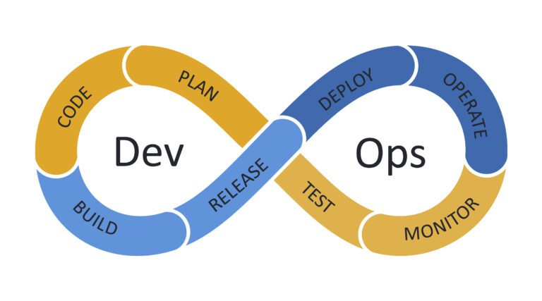
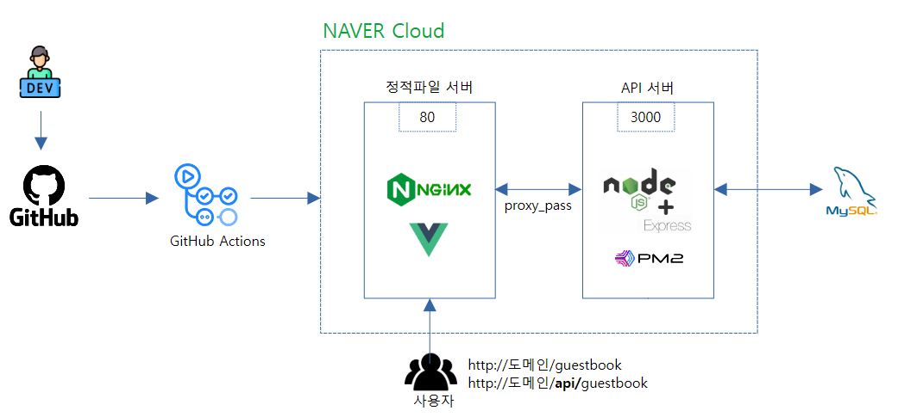
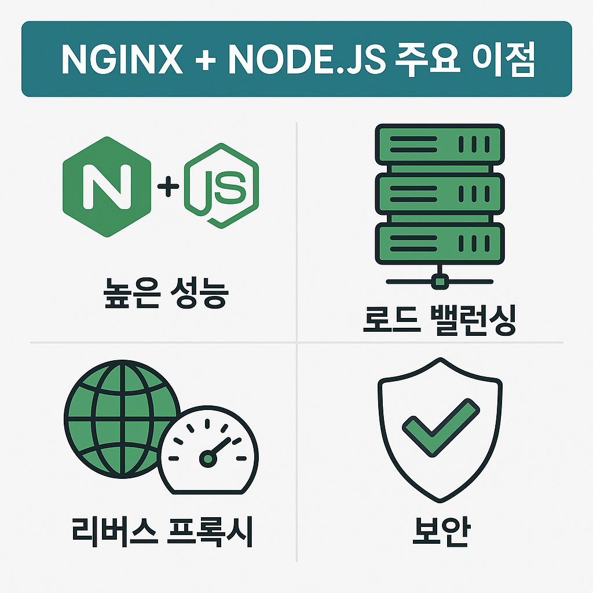
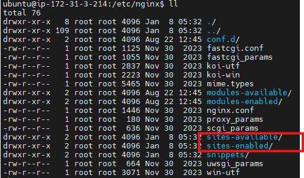
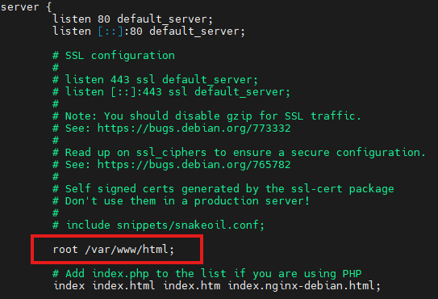
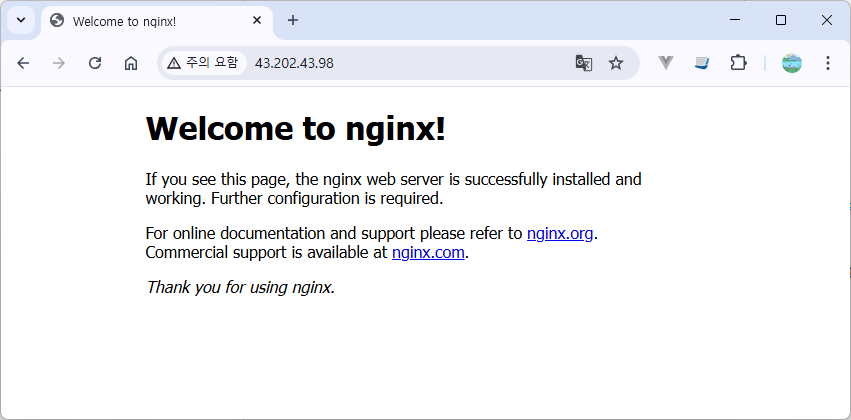

# DevOps

**데브옵스(DevOps) = 소프트웨어 개발(`Dev`elopment) + IT 운영(`Op`erations)**


기존에 사일로에 묶여 있던 개발과 운영이라는 두 팀 간의 장벽을 없애고 개발과 배포 프로세스를 자동화하고 협업을 강화함으로써 애플리케이션과 서비스를 더 빠르고 안정적으로 제공하는 문화, 철학, 방법론, 그리고 도구의 총체를 말합니다.

> 사일로(Silo)'는 원래 곡물 등을 저장하는 원통형 창고를 뜻하지만, 경영학에서는 조직 내 부서 간 장벽이나 부서 이기주의

## DevOps 방식


[이미지참조](https://www.redhat.com/ko/topics/devops/what-is-ci-cd)

**CI(지속적 통합)** 은 자동화된 빌드 및 테스트가 수행된 후, 개발자가 코드 변경 사항을 중앙리포지토리에 정기적으로 병합하는 소프트웨어 개발 방식입니다.

**CD(지속적 전달/배포)** 에서 지속적 전달은 프로덕션에 릴리스하기 위한 코드 변경이 자동으로 빌드, 테스트 및 준비되는 소프트웨어 개발 방식입니다. 빌드 단계 이후의 모든 코드 변경 사항을 테스트 환경 및/도는 프로덕션 환경에 배포합니다.

## 배포 아키텍쳐



- 정적파일 요청 --> Nginx가 직접 처리
- API 요청 --> Node.js로 프록시

서버구성

| 서버  | 역할                 | 포트        |
| :---- | :------------------- | :---------- |
| Nginx | Vue 정적 파일 서비스 | 80 / 443    |
| Node  | API 서버             | 3000        |
| DB    | MySQL, Oracle, etc   | 3306 / 1521 |

## Nginx와 Node 통합 이점

node.js를 reverse proxy server 뒤에 숨기지 않고도 바로 서버로 이용할 수 있습니다. 그러나 보안적 이슈로 reverse proxy sever 거치는게 안전하며 추가적으로 방화벽 설정, https 보안 적영, 도메인 적용등을 할 수 있습니다.  
Node.js는 단일 스레드, 이벤트 기반 모델로 작동하여 가볍고 효율적이지만, 정적 파일 제공, SSL 종료, 로드 밸런싱 등의 기능에서는 Nginx가 더 뛰어난 성능을 보여줍니다.

두 기술을 함께 사용했을 때의 주요 이점입니다:

1. **정적 자원의 효율적인 제공**: Nginx는 이미지, CSS, JavaScript 등 정적 파일을 매우 효율적으로 제공합니다.
2. **로드 밸런싱**: 여러 Node.js 인스턴스 간에 트래픽을 분산시켜 애플리케이션 가용성을 높입니다.
3. **보안 강화**: SSL/TLS 종료, 기본적인 DDoS 보호 등을 Nginx가 담당합니다.
4. **캐싱**: Nginx의 강력한 캐싱 기능으로 반복 요청에 대한 서버 부하를 줄입니다.
5. **멀티코어 활용**: 단일 스레드인 Node.js의 한계를 Nginx를 통해 보완할 수 있습니다.



[이미지참조](https://ai-one.tistory.com/entry/Nginx와-Nodejs-연계-완벽한-웹-서버-구축-가이드)

> `rever proxy server`란 proxy server의 한 종류로서, 클라이언트로부터 요청을 받아와 내부망의 서버로 포워드하는 서버를 말합니다. 클라이언트와 서버 간의 중간 매개체 역할을 합니다.

## Node(Express)로 WAS 구축하기

### nvm으로 node 설치

```sh
# 패키지 업데이트
sudo apt-get update

# nvm 설치
curl -o- https://raw.githubusercontent.com/nvm-sh/nvm/v0.35.1/install.sh | bash
source ~/.bashrc

# nvm 설치 확인
nvm --version

# nvm 명령어로 node와 npm을 설치
nvm install 24.11.0
```

(선택) node 버전을 변경하려면

```sh
# 사용가능한 노드 버전 조회
$ nvm list available

# 사용할 버전의 노드 설치
$ nvm install 10.16.3

# 원하는 노드 버전 지정
$ nvm use 22.14.0

# 설치되어 사용가능한 node 버전 조회
$ nvm list
       v10.16.3
->     v22.14.0

# 설치된 node 버전 확인
node -v

# 로그아웃 후 다시 로그인 하면 node 버전이 이전상태로 돌아가 있음

# node 기본 버전 변경
$ nvm alias default v24.11.0

```

### express로 서버 구축

/home/ubuntu/backapp 폴더 생성하고 app.js 파일 생성

```sh
mkdir ~/backapp
cd ~/backapp

vi app.js
# i -> 소스복사붙여넣기 -> ESC -> :wq 엔터키
```

app.js 파일 소스

```javascript
//app.js
const express = require("express");
const app = express();
const port = 3000;

app.get("/", (req, res) => {
  res.send("Hello World! node express");
});

app.listen(port, () => {
  console.log(`Example app listening on port ${port}`);
});
```

서버 실행

```sh
npm install express
noad app.js
```

서버 구동 확인

```sh
# curl 로 확인
curl http://localhost:3000

# 브라우저로 확인
```

백그라운드 실행

로그인한 세션에서 계속 입력을 하기 위해 프로세스를 백그라운드로 실행  
`포그라운드`로 실행할 경우 터미널을 통해 다른 일을 할 수 없음.
`백그라운드 기능`을 사용하면 한 터미널에서 여러 개의 프로세스를 동시에 실행시키고 작업을 할 수 있음.  
부모 프로레스와 세션이 공유되기 때문에 부모프로세스(터미널)를 종료되면 자식인 프로세스에 종료 신호가 전달되어 `같이 종료`됨.  
`데몬`은 백그라운드 프로세스이며 데몬은 터미널을 갖지 않으며 항상 실행될 수 있다.

```sh
# 백그라운드에서 실행 ( & )
$ node app.js > server.log 2>&1 &

# 백그라운드 프로세스 확인(현재 쉘 세션의 작업목록 표시)
$ jobs
[1]+  Running                 node app.js > server.log 2>&1 &

# 백그라운드나 중지된된 프로세스를 포그라운드로 전환
$ fg

node app.js > server.log 2>&1 &   # 출력결과를 파일에 저장
node app.js > /dev/null 2>&1 &    # 출력결과를 안보이게
^Z                                # ^Z : 중지
                                  # ^C : 종료
[1]+  Stopped                 node app.js > server.log 2>&1

# 중지된 작업을 백그라운드에서 계속 실행
$ bg

# 터미널(현재 새션) 닫기
$ exit
```

nohup

- 현재 사용자 세션이 아닌 **운영체제가 제공하는 백그라운드 공간에서 실행**하므로 사용자의 세션이 종료되어도 지금 실행시킨 프로세스는 종료되지 않는다.
- &는 로그아웃하거나 ssh 세션, stty 가 끊어지면 그 명령도 종료됨.
- 데몬처럼 부모프로세스 종료 시 자식 프로세스에게 신호를 전달하지 않게 하여 부모프로세스(터미널)가 종료되더라도 자식 프로세스가 종료되지 않게 할 수 있음.
- nohup 에 별도 리다이렉션이 없으면 표준출력과 표준에러는 nohup.out 이란 파일에 기록함.

사용자의 세션이 종료되어도 유지되는 프로세스를 백그라운드로 실행

```sh
$ nohup node app.js > server.log 2>&1 &
```

프로세스 종료

```sh
## 실행중인 프로세스 상태 표시 e: Every  f: Full format
$ ps -ef | grep node
    PID TTY          TIME CMD
  27367 pts/0    00:00:00 node

# 프로세스 종료
$ kill -9 27367
```

### [PM2](https://pm2.keymetrics.io/docs/usage/quick-start/)

**PM2**는 `프로세스 관리` 및 운영에 중점을 둔 도구로 `자동복구`, 클러스터링, 로드밸런싱 등 `프로덕션 환경`에 필요한 강력한 기능들을 제공하여 `무중단서비스`에 적합

> **Nodemon**은 개발할 때 파일 변경 감지를 통한 `자동 재시작`에 특화된 도구로 주로 개발환경에서 사용

#### PM2 장점

클러스터 모드: Node.js 부하 분산 및 제로 다운타임 리로드  
https://inpa.tistory.com/entry/node-%F0%9F%93%9A-PM2-모듈-사용법-클러스터-무중단-서비스  
Node JS 프로세서를 관리하는 패키지

- `백그라운드`에서 데몬으로 실행이 됨. 터미널을 끄더라도 서버가 꺼지지 않음.
- 프로세스 매니저로 node 서버가 갑자기 꺼져버려도 자동으로 `재구동`도 가능 .
- Node.js는 싱글 스레드 기반이지만, `멀티 코어` 혹은 하이퍼 스레딩을 사용할 수 있게 해준다.
- 클라이언트로부터 요청이 올 때 알아서 요청을 여러 노드 프로세스에 고르게 분배(`로드 밸런싱`)

#### PM2 단점

- 세션을 메모리에 저장하는 경우 메모리를 공유할 수 없음. 세션 메모리가 있는 프로세스로 요청이 가면 로그인된 상태가 되고, 세션 메모리가 없는 프로세스로 요청이 가면 로그인되지 않은 상태가 됨.
- 하나의 프로세스 내에서 돌아가는 멀티 스레드는 메모리를 공유할 수 있지만, 멀티 프로세스는 프로세스간의 메모리 공유를 할 수 없다.
- 단점을 보완하기 위해 세션을 공유할 수 있게 멤캐시드나 `레디스`(redis) 같은 서비스를 사용함.

#### pm2 설치

```sh
# pm2 global(전역 설치) 패키지를 현재 프로젝트가 아닌 시스템의 node_modules에 설치
npm install pm2 -g

# 시스템 node_modules 경로 확인
npm root -g
# 실행결과: /home/ubuntu/.nvm/versions/node/v24.11.0/lib/node_modules

# pm2 버전 확인
pm2 --version

# pm2 업데이트
pm2 update

```

#### pm2 실행옵션

| 옵션                | 설명                                                                   | 예시                                   |
| :------------------ | :--------------------------------------------------------------------- | :------------------------------------- |
| --watch             | 실행된 프로젝트의 변경사항을 감지하여 서버를 자동 재시작(reload)       |                                        |
| --ignore-watch      | watch 옵션 사용 시에 특정 폴더 경로는 무시해야 할 때                   |                                        |
| --i max(코어개수)   | Node.js의 싱글 스레드를 보완하기 위한 클러스터 모드                    |                                        |
| --name 이름         | 앱 이름 지정                                                           |                                        |
| --log 로그경로      | 로그파일 경로 지정                                                     |                                        |
| scale app +2        | 프로세스 수 증가 또는 감소                                             |                                        |
| status /ls / status | 현재 프로세스 리스트                                                   |                                        |
| stop                | 프로세스 중지                                                          |                                        |
| restart             | 프로세스 재시작                                                        |                                        |
| reload              | 프로세스 리로드                                                        |                                        |
| delete 2            | 특정 프로세스 중지                                                     |                                        |
| delete app          | 이름이 app인 모든 프로세스 중지                                        |                                        |
| kill                | 프로세스 전체 삭제                                                     |                                        |
| log                 | 전체 프로세스 로그 보기                                                | pm2 log                                |
|                     | 특정 프로세스 로그 보기                                                | pm2 log 프로세스이름 또는 프로세스아디 |
|                     | 프로세스 로그 200줄까지만 보기기                                       | pm2 log app --lines 200                |
|                     | 에러 로그 보기                                                         | pm2 log --err 200                      |
| show                | 프로세스 정보                                                          |                                        |
| monit               | 모니터링. 실시간 상태 확인(각 프로세스의 메모리, CPU 사용율, 현재상태) |                                        |
| save                | 지금 실행 중인 모든 Node 프로세스 목록을 저장                          |                                        |
| startup             | 서버가 부팅될 때 PM2가 자동으로 실행되도록 OS에 등록                   |                                        |

restart와 reload 차이점  
restart는 모든 프로세스를 죽인 다음 다시 시작하는 방식으로 아주 잠깐동안 서비스를 이용하지 못하는 상황이 생길 수 있음.  
reload는 최소한 1개 이상의 프로세스를 유지하며 하나씩 재시작하는 방식으로 재시작 하는 동안 서비스를 이용못하는 상황을 미연에 방지할 수 있음(0-second-downtime). 재실행 속도가 느리다는 단점이 있음.

```sh
# pm2 실행
pm2 start app.js

# pm2로 실행중인 프로세스 확인
pm2 list

# 프로세스 로그 확인
pm2 logs app

# 프로세스 중지
pm2 stop app

# 지금 실행 중인 모든 Node 프로세스 목록을 저장
pm2 save

# 서버가 부팅될 때 PM2가 자동으로 실행되도록 OS에 등록
pm2 startup

# 프로세스를 감시하여 리로드하
pm2 start app.js --watch

# 도록 하고 멀티코어로 서버 실행(클러스터 모드)
pm2 start app.js  -i 2
```

### Nginx 로 웹서버 구축하기

#### 패키지 설치

```sh
sudo apt update
# 설치
sudo apt install nginx
# 버전 확인
nginx -v
# 서버 구동
sudo systemctl start nginx        # sudo service nginx start
```

nginx 폴더 구조

```sh
cd /etc/nginx
ll
cd sites-available
ll
cat default
```





Nginx의 sites-available과 sites-enabled 디렉토리는 여러 웹사이트(가상 호스트) 설정을 효율적으로 관리하기 위한 구조로, **sites-available**에는 모든 사이트의 설정 파일이 보관되고, **sites-enabled**에는 심볼릭 링크(바로가기)를 통해 활성화할 사이트의 설정 파일만 연결되어 Nginx가 읽게 됩니다.

브라우저로 서버 구동 확인

```
http://ip주소
```



#### 새 웹사이트를 배포

웹사이트 생성

```sh
mkdir /var/www/frontapp
cd /var/www/frontapp
vi index.html
```

설정파일 원본 생성

```bash
sudo nano /etc/nginx/sites-available/frontapp
```

설정파일

```sh
server {
    listen 80;
    server_name _;

    root /var/www/frontapp;
    index index.html;

    location / {
        try_files $uri $uri/ /index.html;
    }
}

```

설정파일 링크 생성

```bash
sudo rm /etc/nginx/sites-enabled/default
sudo ln -s /etc/nginx/sites-available/frontapp /etc/nginx/sites-enabled/

# 설정파일 문법검사
sudo nginx -t

# nginx 다시시작
sudo systemctl reload nginx

# 테스트
curl http://localhost

# 로그 보기
cat /var/log/nginx/access.log

```

#### https 설정

### 리눅스 명령어

- cd
- vi
- nano
- history
- unzip
- chmod
- chown
- mkdir
- mv
- rm
- rmdir

#### history: 이전 명령어 실행 방법

명령어를 수행하면 메모리에 먼저 저장되었다가 log out(log off)시에 .bash_history가 이전에 수행했던 명령어들을 저장한다. 로그아웃 후 다시 접속하더라도 history는 남아 있음.

```sh
$ history         # 이전에 실행했던 명령어 확인
$ !번호           # 이전 명령어 다시 실행
$ echo $HISTSIZE  # history 내용 저장 갯수
$ history -c      # history clear
```

#### history 출력 포멧 지정

/etc/profile 파일에 HISTTIMEFORMAT 환경변수를 지정합니다.

```sh
$ vi /etc/profile
```

```sh
# History Command Execute Time
export HISTTIMEFORMAT="%F %T "
```

#### unzip

```sh
# unzup 설치
sudo apt install unzip
```
