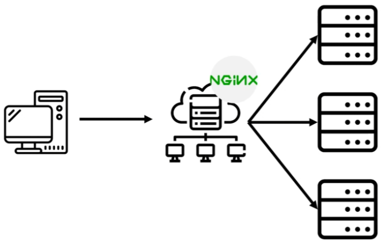

## vue + node 배포

### 학습목표

프로젝트 빌드 후 운영모드(production)로 각각의 포트로 인스턴스를 생성하여 nginx 80 포트로 인스턴스들을 로드 밸런싱

### 작업순서


1. Vue 프론트엔드 빌드
2. vue와 node 연동하기(Vue 정적파일 서빙 + API 연결)
3. Naver Cloud 서버 준비 (Ubuntu 가상 서버)
4. 서버에 파일 업로드 (Vue 빌드 + Node 서버)
5. 서버에 node 설치. (&, nohup)
6. PM2로 Node 서버 실행(클러스터 무중단 서비스)
7. Nginx로 프록시 설정
8. (선택) 도메인 연결 및 HTTPS 설정 (Let's Encrypt)
9. github action

### 1. Vue 프론트엔드 빌드

node express를 실행했을 때 Vue로 만든 웹프론트도 함께 실행되도록 함.

#### frontend/vue.config.js 파일 수정

```javascript
const { defineConfig } = require("@vue/cli-service");
const path = require("path");

const server = "http://localhost:3000";

module.exports = defineConfig({
  transpileDependencies: true,
  outputDir: path.resolve("../backapp/public"),
  // 개발용 임시 서버
  devServer: {
    // Vue.js 실행 시 적용 PORT 변경
    port: 8099,
    // CORS(Cross Origin Resource Sharing) => proxy setting
    proxy: {
      // 해당 문자열로 시작하는 통신에 적용하는 설정
      "^/api": {
        // 변경할 Origin
        target: server,
        // Origin 변경 : http://localhost:8099 -> http://localhost:3000
        changeOrigin: true,
        // URL 중 일부분을 다시 작성 : /api/books -> /books
        pathRewrite: { "^/api": "/" },
        // websocket 설정 비활성화
        ws: false,
      },
    },
  },
});
```

배포할 위치 설정

```javascript
outputDir: path.resolve("../backapp/public"),
```

vue build

```sh
$ npm run build
```

build 후 생성된 배포 파일  


### 2. vue와 node 연동하기

Node만을 실행했을 때 Vue도 함께 실행되므로 Vue에서 만든 front에 접근하기 위해선 접근할 url을 지정.

#### backend/app.js 수정

```javascript
const express = require("express");
const path = require("path");
const app = express();
const port = 3000;

app.get("/hello", (req, res) => {
  console.log(req.url);
  res.send("Hello World!");
});

app.get("/api/board", (req, res) => {
  res.send({ title: "Hello World!" });
});

//node의 router와 vue의 router를 연결
app.get("/", function (req, res, next) {
  res.sendFile(path.join(__dirname, "./public", "index.html"));
});

app.use((req, res) => {
  res.status(404).sendFile(path.join(__dirname, "./public", "index.html"));
});

app.listen(port, () => {
  console.log(`Example app listening on port ${port}`);
});
```

'/' endpoint에 vue의 index.html을 라우팅함.

```javascript
const path = require("path");

app.get("/", function (req, res, next) {
  res.sendFile(path.join(__dirname, "./public", "index.html"));
});
```

새로고침해도 동작하도록 404 error 처리 미들웨어 추가

```javascript
app.use((req, res) => {
  res.status(404).sendFile(path.join(__dirname, "./public", "index.html"));
});
```

#### 테스트

브라우저에서 테스트. node만 실행해도 vue도 같이 동작됨. 3000포트로 테스트

```
http://localhost:3000
```

### 3. Naver Cloud 서버 준비 (Ubuntu 가상 서버)

네이버 서버 구축 : https://devmg.tistory.com/346

### 4. 서버에 node 설치

nvm을 이용하여 node 설치  
nvm(node version manager) : 여러 개의 노드 버전을 사용할 수 있는 도구

```sh
# 패키지 업데이트
sudo apt-get update

# nvm 설치
curl -o- https://raw.githubusercontent.com/nvm-sh/nvm/v0.35.1/install.sh | bash
source ~/.bashrc


# nvm 설치 확인
nvm --version

# nvm 명령어로 node와 npm을 설치
nvm install 24.11.0
```

### 5. 서버에 소스 내려받기

```sh
# git clone
git clone https://github.com/cyannara/project.git

# .env 파일 전송
```

### 6. 서버 실행

```sh
cd backend
# 노드 서버 패키지 설치
npm install
# 서버 실행
node app.js
#node app.js &
#node app.js > /dev/null 2>&1 &
#node app.js > ~/server.log 2>&1 &

# 서버 구동 테스트
curl http://localhost:3000/api/guestbook
```

브라우저로 서버 연결 확인(방화벽 포트 3000 열고나서 확인)

```sh
http://54.180.202.222:3000
```

### 7. [PM2](https://pm2.keymetrics.io/docs/usage/quick-start/)로 Node 서버 실행

```sh
# pm2 global(전역 설치) 패키지를 현재 프로젝트가 아닌 시스템의 node_modules에 설치
npm install pm2 -g

# pm2 실행
pm2 start app.js

# pm2로 실행중인 프로세스 확인
pm2 list

# 프로세스 로그 확인
pm2 logs app
```

### 8. [Nginx](https://wikidocs.net/223842)



- 프록시 설정
- 로드밸런싱하여 무중단으로 배포 할 수 있는 환경 구성하기
- 80/443 포트 진입점, Node로 트래픽 전달

#### Nginx 설치

```sh
sudo apt update
sudo apt install nginx
nginx -v
```

#### Nginx 구동

```sh
sudo systemctl start nginx        # sudo service nginx start
```

#### 브라우저 테스트

```
http://서버ip:80
```

#### [Nginx를 reverse proxy server로 설정하기](https://dreaminggore00.tistory.com/8)

```sh
sudo vi /etc/nginx/sites-available/default
```

```shell
server {
        listen 80;
      #  listen [::]:80;

        access_log /var/log/nginx/reverse-access.log;
        error_log /var/log/nginx/reverse-error.log;

        location / {
                    proxy_pass http://127.0.0.1:3000;
       }
}
```

`proxy_pass` 리다이렉트할 서버 주소  
`proxy_redirect` default, off, redirect replacement 3가지의 value를 가질 수 있습니다. off는 혹시나 이전 레벨에서 설정된 proxy_redirect 영향을 삭제시키는 기능  
`proxy_set_header` 브라우저 헤더에 저장할 정보

proxy_pass http://127.0.0.1:3000/  
 proxy_pass 뒤에 / 가 있으면  
 /api/guestbook → /guestbook 으로 변환되어 Node에 전달됩니다.

[proxy_path 참조](https://nginx.org/en/docs/http/ngx_http_proxy_module.html#proxy_pass)

#### Nginx 서버 재시작

```sh
$ sudo systemctl reload nginx     # sudo service nginx restart
$ sudo systemctl status nginx
```

reload는 설정 변경 시 서비스 중단없이 변경사항을 적용하며 기존 연결은 유지됨. restart는 서비스를 완전히 종료했다가 재시작하므로 모든 연결이 끊어짐. 설정파일만 변경된 경우는 reload를 사용하고

#### 브라우저 테스트

```
http://서버ip:80
```

#### 로그보기

```bash
cat /var/log/nginx/access.log
cat /var/log/nginx/error.log
```

### 9. [github action](https://docs.github.com/ko/actions)

- CI/CD를 위한 github 서비스. github에 push 하면 NCP 서버에 자동 배포되도록 설정
- workflow라고도 함. 트리거 이벤트가 발생하면 시작되는 일련의 동작이며 yaml 파일로 저장
- workflow는 job들로 나눠지며 각 job은 일련의 스텝을 수행
- [quickstart](https://docs.github.com/ko/actions/writing-workflows/quickstart) 따라하기


<font size="1px"><a href="https://www.flaticon.com/kr/free-icons/vm" title="vm 아이콘">Vm 아이콘 제작자: Vectors Tank - Flaticon</a></font>

#### 1) github에서 ssh 접속 시 사용할 키들 생성하여 등록

##### 로컬에서 ssh 키생성

```sh
# 키생성
C:\Users\user> ssh-keygen -t rsa -b 4096 -C "github-action"

C:\Users\user> cd .ssh
C:\Users\user\.ssh> dir

 Directory of C:\Users\user\.ssh

2025-05-16  오전 07:54             3,381 id_rsa
2025-05-16  오전 07:54               740 id_rsa.pub

# 메모장에서 공캐키 파일 내용 복사
C:\Users\user\.ssh>notepad id_rsa.pub
```

##### 서버에 공개키 등록

```sh
#ssh ubuntu@your-server-ip
#mkdir -p ~/.ssh
sudo vi ~/.ssh/authorized_keys
# id_rsa.pub(공개키) 내용을 추가로 붙여넣기  o -> shift+insert -> :wq
```

##### GitHub에 Secrets 등록

GitHub → Settings → Secrets → Actions

| 키 이름         | 설명                     |
| :-------------- | :----------------------- |
| SSH_HOST        | 서버 주소 또는 IP        |
| SSH_USER        | ubuntu                   |
| SSH_PRIVATE_KEY | SSH 개인키 (id_rsa) 내용 |

GitHub Actions 워크플로우 설정

#### .github/workflows/deploy.yml 생성:

- workflow : github action에서 작업할 프로세스를 정의. (test, build,package, deploy)
- on(event) : workflow에서 감지하는 이벤트(push, pr)
- jobs : workflow는 하나 이상의 job으로 구성되며 병렬로 작업이 진행
- steps : 하나의 job은 여러 step으로 구성되며 작업순서를 지정. users는 미리 만들어진 명령어를 실행하는 것이고 run은 명령어 실행

```yaml
name: Build Vue and Deploy Node App

on:
  push:
    branches:
      - main

jobs:
  deploy:
    runs-on: ubuntu-latest

    steps:
      - name: Checkout repository
        uses: actions/checkout@v3

      - name: Setup Node.js
        uses: actions/setup-node@v3
        with:
          node-version: "20"

      - name: Install frontend dependencies
        working-directory: ./frontend
        run: npm ci

      - name: Build Vue app
        working-directory: ./frontend
        run: npm run build

      - name: Setup SSH key
        run: |
          mkdir -p ~/.ssh
          echo "${{ secrets.SSH_PRIVATE_KEY }}" > ~/.ssh/id_rsa
          chmod 600 ~/.ssh/id_rsa
          ssh-keyscan -H ${{ secrets.SSH_HOST }} >> ~/.ssh/known_hosts

      - name: SSH into server and deploy
        run: |
          ssh ${{ secrets.SSH_USER }}@${{ secrets.SSH_HOST }} << 'EOF'
            cd ~/project
            git pull origin main
            npm install --prefix backend
            pm2 restart backend || pm2 start backend/index.js --name "app"
            pm2 save
          EOF
```

## github action 예시

```yml
name: GitHub Actions Demo
run-name: ${{ github.actor }} is testing out GitHub Actions 🚀
on: [push]
jobs:
  Explore-GitHub-Actions:
    runs-on: ubuntu-latest
    steps:
      - run: echo "🎉 The job was automatically triggered by a ${{ github.event_name }} event."
```

github.actor  
github.event_name  
github.ref  
github.repository  
github.workspace  
runner.os  
job.status

```yml
- name: Copy dist to backend/public
  run: |
    rm -rf backend/public
    mkdir -p backend/public
    cp -r frontend/dist/* backend/public/

- name: SSH into server and deploy
  uses: appleboy/ssh-action@v1.0.3
  with:
    host: ${{ secrets.SSH_HOST }}
    username: ${{ secrets.SSH_USER }}
    key: ${{ secrets.SSH_KEY }}
    script: |
      cd /home/ubuntu/project
      git pull origin main
      npm install --prefix backend
      pm2 restart app || pm2 start backend/app.js --name "app"
      pm2 save
```

### referer

https://velog.io/@new_wisdom/AWS-EC2%EC%97%90-Node.jsExpress-pm2-nginx-배포하기#-ubuntu-기본-세팅--nodejs-pm2-nginx-설치
